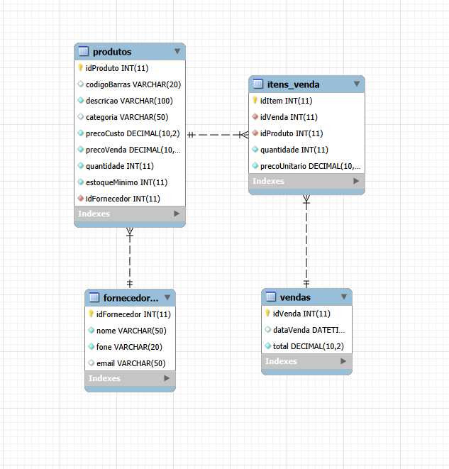
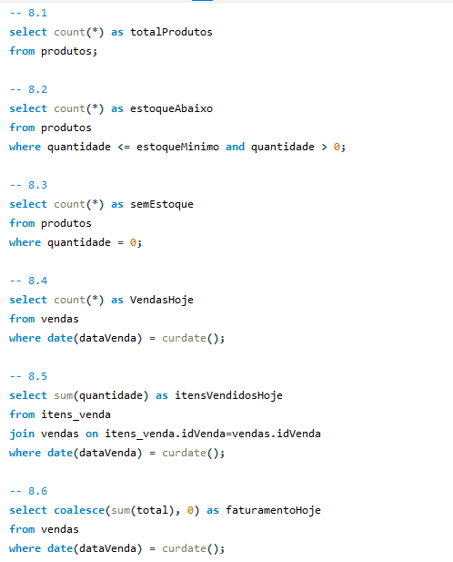

# JAPDV - Controle de Estoque e Vendas

Projeto de modelagem de banco de dados relacional e consultas SQL avançadas desenvolvido para o sistema de PDV de uma papelaria.

## Tecnologias Utilizadas
* XAMPP (MySQL Server)
* MySQL / MySQL Workbench
* Modelagem Relacional (DER)
* Consultas Avançadas (JOINs, Funções de Agregação, Subconsultas, KPIs)

## Estrutura do Banco (`japdv`)
O banco de dados é composto por 4 tabelas principais:
* `fornecedores`: Cadastro dos fornecedores parceiros.
* `produtos`: Gestão de itens, preços de custo/venda e estoque mínimo.
* `vendas`: Registro de transações com data/hora automatizada.
* `itens_venda`: Detalhamento dos produtos vendidos em cada transação (com restrição de exclusão em cascata).

## Diagrama Entidade-Relacionamento (DER)
*(Cole aqui o print do seu diagrama gerado no MySQL Workbench)*

  

## Visualização das Consultas e Indicadores
*(Cole aqui prints do MySQL Workbench mostrando as consultas ou os desafios extras rodando)*

  

## Como Executar
1. Faça o download ou clone o arquivo `japdv.sql`.
2. Abra o seu **MySQL Workbench**.
3. Execute o script completo do arquivo para criar o banco, estruturar as tabelas, popular com os dados de teste e testar as consultas e desafios extras.

---
> Projeto prático desenvolvido durante o curso **Técnico em Informática** no **Senac Tatuapé (Cel. Luís Americano)**.
